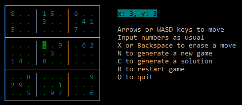

# C sudoku solver



A C implementation of a interactive sudoku game that can be solved with a backtracking algorithm, essentially a brute force algorithm visits the empty cells in some order, filling in digits sequentially, or backtracking when the number is found to be not valid. [see here.](https://en.wikipedia.org/wiki/Sudoku_solving_algorithms)

It uses the ncurses library for its graphical interface, so make sure to install it if you haven't already.
 ```
 $sudo apt-get install libncurses5-dev libncursesw5-dev
 ```
 
 Then run it with these commands and follow the screen instructions.
 ```
 $make
 $./sudoku
 ```
